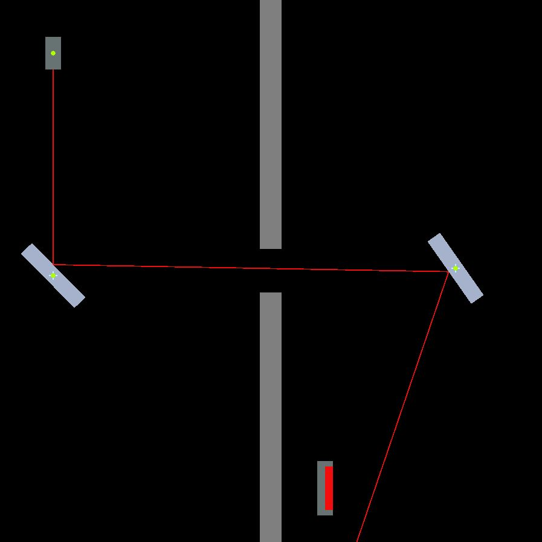
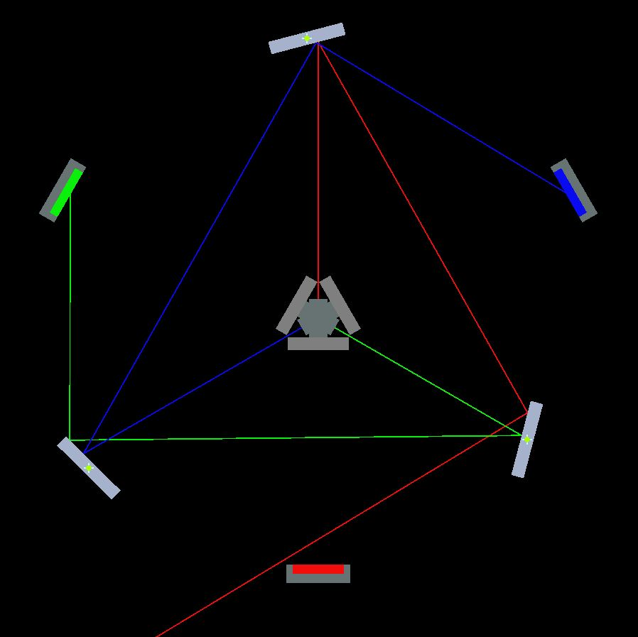
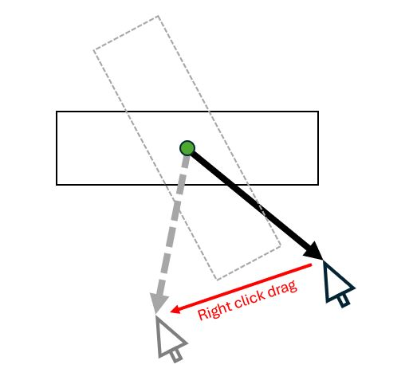

# Mirror Game

## Overview
Mirror is a simple game about redirecting lasers with mirrors to reach an objective.  In each level, you move and rotate mirrors, lasers, targets, and/or blockers to guide each laser to the target.

## Gameplay Components
**Lasers**: Each level has at least one laser in it.  The goal is to guide the lasers to the targets.  Lasers can have different colors.  
**Mirrors**: Levels can have mirrors, which reflect any laser beams that hit them.  
**Targets**: Each level has at least one target in it.  The level is complete when all targets are being hit by enough lasers.  Targets only accept lasers of their color.  
**Blockers**: Levels can have blockers, which absorb any laser beam that hits them.  The level borders also behave as blockers.  

## Controls
**Move**: Any components with a blue cross on them can be moved around using by left click and dragging. Objects cannot be moved into each other, though objects may spawn overlapping each other.  
**Rotate**: Any components with a green circle on them can be rotated using right click and dragging.  Objects cannot be rotated into each other.  The rotation mechanic works by drawing a ray from the object's pivot point to the point where the user clicked on the object.  When the user drags the mouse around, this ray is redrawn and the object is rotated along with it.

